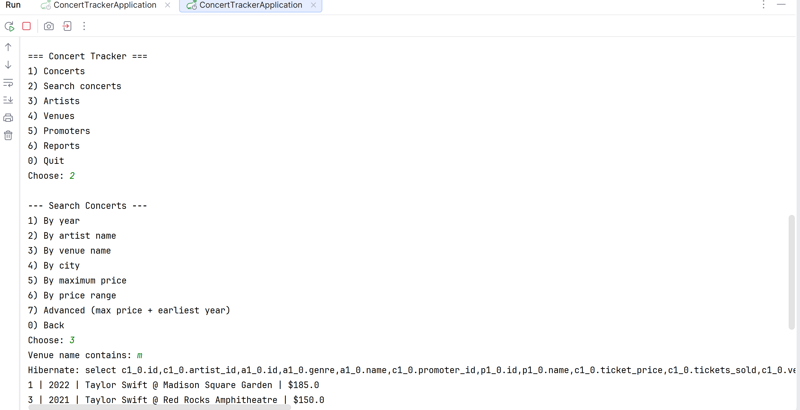

# Concert Tracker

## Description of the Project

Concert Tracker is a Java console application built with Spring Boot and JPA that manages a concert inventory and reporting system. It allows users to view, search, add, update, and delete concerts, artists, venues, and promoters through an interactive text-based menu.

The application connects to a MySQL database using Spring Data JPA. On first launch it seeds the database with sample data so the app is ready to use immediately. All data is persisted across sessions — changes made in one run are visible the next time the application starts.

This project demonstrates core Java and Spring concepts including object-oriented design, Spring Boot auto-configuration, JPA entity relationships (`@ManyToOne`), derived query methods, JPQL aggregate queries, and a layered architecture with model, repository, service, and runner packages.

---

## User Stories

- As a user, I want to view all concerts so that I can see the complete event history.
- As a user, I want to search concerts by year, artist, venue, city, and ticket price so that I can filter results quickly.
- As a user, I want to add a new concert linked to an existing artist, venue, and promoter so that the database stays current.
- As a user, I want to update ticket price and tickets sold on an existing concert so that records reflect real changes.
- As a user, I want to delete a concert, artist, venue, or promoter so that outdated records can be removed.
- As a user, I want to add and manage artists, venues, and promoters independently so that I can build up the reference data.
- As a user, I want to see a revenue report per venue so that I can identify the most profitable locations.
- As a user, I want to see the busiest venue and artist by concert count so that I can spot trends.
- As a user, I want to see average ticket price by year so that I can track pricing over time.
- As a user, I want to see a capacity report showing percentage of seats sold and sold-out flags so that I can evaluate event performance.

---

## Setup

### Prerequisites

- IntelliJ IDEA installed
- Java 17 SDK installed and configured
- MySQL server running locally
- A MySQL database created for the application

### Configuring the Database

Open `src/main/resources/application.properties` and fill in your MySQL connection details:

```properties
spring.datasource.url=jdbc:mysql://localhost:3306/your_database_name
spring.datasource.username=your_username
spring.datasource.password=your_password
spring.jpa.hibernate.ddl-auto=update
```

### Running the Application in IntelliJ IDEA

1. Open **IntelliJ IDEA**.
2. Select **Open** and navigate to the project folder (`concert-tracker`).
3. Wait for IntelliJ to index the files and import the Maven dependencies.
4. Click **Reload Maven Project** if prompted after the `pom.xml` is opened.
5. Locate `ConcertTrackerApplication` in the `com.pluralsight.concerttracker` package.
6. Right-click it and select **Run 'ConcertTrackerApplication'**.
7. The application seeds the database automatically on first run and opens the interactive menu in the console.

---

## Technologies Used

- **Java 17**
- **Spring Boot 4.1** — application framework and auto-configuration
- **Spring Data JPA** — repository layer and JPQL queries
- **Hibernate** — ORM / database interaction
- **MySQL** — relational database
- **Maven** — build and dependency management

---

## Demo

## Future Work

- Add input validation to catch non-numeric entries more gracefully across all prompts.
- Add a menu option to view all saved contracts or export reports to a file.
- Support searching artists by multiple genres at once.
- Add a date field to concerts so events can be sorted and filtered chronologically.
- Replace the console menu with a REST API layer so the app can serve a web front end.
- Add unit and integration tests for the service layer.

---

## Resources

- [Spring Boot Documentation](https://spring.io/projects/spring-boot)
- [Spring Data JPA Documentation](https://spring.io/projects/spring-data-jpa)
- [Java 17 Documentation](https://docs.oracle.com/en/java/javase/17/)
- [MySQL Documentation](https://dev.mysql.com/doc/)
- IntelliJ IDEA
- Class notes and project instructions

---

## Team Members

- Gwamaka Mwamtobe

---

## Thanks

Thank you to **Raymond** for continuous support and guidance throughout this project.
